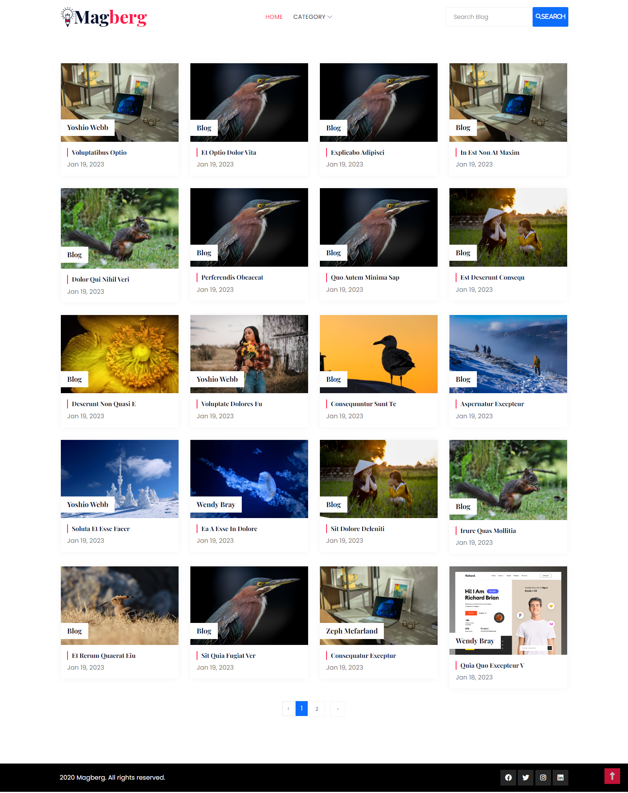
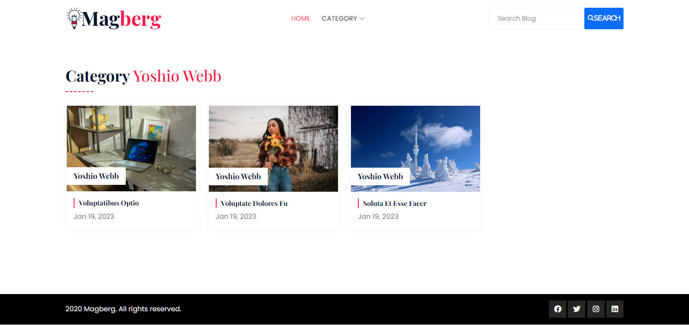
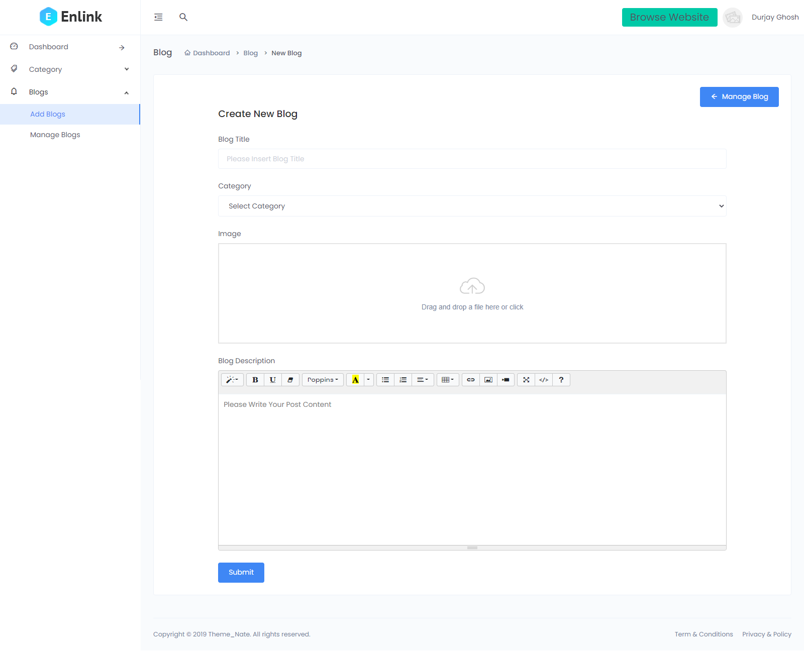

# Getting started

## Installation

Please check the official laravel installation guide for server requirements before you start. [Official Documentation](https://laravel.com/docs/9.x)

Clone the repository

    git clone https://github.com/durjaygp/laravel-simple-crud-blog-with-search.git

Switch to the repo folder

    cd laravel-simple-crud-blog-with-search

Install all the dependencies using composer

    composer install

Copy the example env file and make the required configuration changes in the .env file

    copy .env.example .env

Generate a new application key

    php artisan key:generate

Install the database <h1>blog.sql</h1>

Start the local development server

    php artisan serve

You can now access the server at http://localhost:8000

## Home Page

## Category Page

## Add Blog Page

